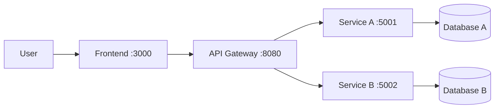

# Project Name

[](https://github.com/hungdn1701/microservices-assignment-starter/stargazers)
[](https://github.com/hungdn1701/microservices-assignment-starter/network/members)
[](LICENSE)

> Brief description of the business process being automated and the service-oriented solution.

> **New to this repo?** See [`GETTING_STARTED.md`](GETTING_STARTED.md) for setup instructions, workflow guide, and submission checklist.

---

## Team Members

| Name | Student ID | Role | Contribution |
|------|------------|------|-------------|
|      |            |      |             |

---

## Business Process

Hệ thống tự động hoá quy trình đặt vé xem phim online từ lúc khách hàng duyệt phim đến khi xác nhận vé. Gồm xác thực người dùng, chọn phim / suất chiếu / ghế, áp voucher, tích hợp thanh toán VNPay, giữ ghế tạm thời trong khi thanh toán, và gửi email xác nhận. Luồng saga được Temporal workflow orchestrate để đảm bảo consistency: ghế chỉ chuyển sang BOOKED khi thanh toán thành công, và tự động release khi thất bại hoặc timeout. Actors chính là khách hàng; phạm vi tập trung luồng đặt vé và thanh toán, không bao gồm quản lý rạp phòng chiếu hay chương trình loyalty.

## Architecture

*(Paste or update the architecture diagram from [`docs/architecture.md`](docs/architecture.md) here.)*



| Component | Responsibility | Tech Stack | Port |
|-----------|----------------|-----------|------|
| **Frontend** | UI — đăng nhập, xem phim, chọn ghế, đặt vé, thanh toán | React 18, TypeScript, Vite | 5173 |
| **Gateway** | Single entry point — JWT verify, routing | Python, FastAPI | 5000 |
| **Auth Service** | Register/login/verify JWT | Python, FastAPI, MySQL | 5001 |
| **User Service** | User profile CRUD | Python, FastAPI, MySQL | 5002 |
| **Movie Service** | Movies, showtimes, seats (reserve/confirm/release) | Python, FastAPI, MySQL | 5003 |
| **Voucher Service** | List/validate/redeem voucher | Python, FastAPI, MySQL | 5004 |
| **Booking Service** | Saga orchestrator — Temporal workflow | Python, FastAPI, Temporal SDK, MySQL | 5005 |
| **Payment Service** | VNPay payment URL + IPN/return | Python, FastAPI, MySQL | 5006 |
| **Notification Service** | Gửi email thông báo booking | Python, FastAPI, MySQL | 5007 |
| **MySQL** | DB per service (mỗi service own schema) | MySQL 8.0 | 3307 |
| **Temporal** | Workflow engine cho saga orchestration | Temporal 1.24.2 + PostgreSQL 15 | 7233 |

> Full documentation: [`docs/architecture.md`](docs/architecture.md) · [`docs/analysis-and-design.md`](docs/analysis-and-design.md) · [`docs/analysis-and-design-ddd.md`](docs/analysis-and-design-ddd.md)

---

## Quick Start

```bash
docker compose up --build
```

Verify: `curl http://localhost:8080/health`

> For full setup instructions, prerequisites, and development commands, see [`GETTING_STARTED.md`](GETTING_STARTED.md).

---

## Documentation

| Document | Description |
|----------|-------------|
| [`GETTING_STARTED.md`](GETTING_STARTED.md) | Setup, workflow, submission checklist |
| [`docs/analysis-and-design.md`](docs/analysis-and-design.md) | Analysis & Design — Step-by-Step Action approach |
| [`docs/analysis-and-design-ddd.md`](docs/analysis-and-design-ddd.md) | Analysis & Design — Domain-Driven Design approach |
| [`docs/architecture.md`](docs/architecture.md) | Architecture patterns, components & deployment |
| [`docs/api-specs/`](docs/api-specs/) | OpenAPI 3.0 specifications for each service |

---

## License

This project uses the [MIT License](LICENSE).

> Template by [Hung Dang](https://github.com/hungdn1701) · [Template guide](GETTING_STARTED.md)

