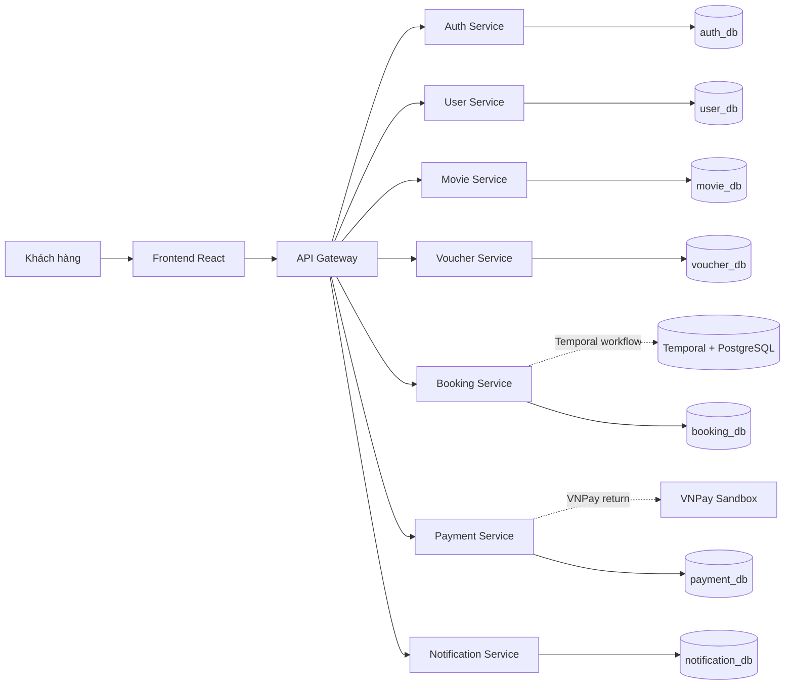

# Đặt vé xem phim online

## Team Members

| Name | Student ID | Role | Contribution |
|------|------------|------|--------------|
| Thành Viên 1 | — | Trưởng nhóm | • Phân tích và thiết kế hệ thống <br> • Implement User Service, Authentication Service, Notification Service và Gateway |
| Thành Viên 2 | — | Thành viên | • Phân tích và thiết kế hệ thống <br> • Implement Movie Service, Voucher Service |
| Thành Viên 3 | — | Thành viên | • Phân tích và thiết kế hệ thống <br> • Implement Payment Service, Booking Service (Temporal saga orchestrator) |

## Business Process

Hệ thống tự động hoá quy trình đặt vé xem phim online từ lúc khách hàng duyệt phim đến khi xác nhận vé. Gồm xác thực người dùng, chọn phim / suất chiếu / ghế, áp voucher, tích hợp thanh toán (mock hoặc VNPay), giữ ghế tạm thời trong khi thanh toán, và gửi email xác nhận. Luồng saga được Temporal workflow orchestrate để đảm bảo consistency: ghế chỉ chuyển sang BOOKED khi thanh toán thành công, và tự động release khi thất bại hoặc timeout. Actors chính là khách hàng; phạm vi tập trung luồng đặt vé và thanh toán, không bao gồm quản lý rạp phòng chiếu hay chương trình loyalty.

## Architecture



| Component | Responsibility | Tech Stack | Port |
|-----------|----------------|-----------|------|
| **Frontend** | UI — đăng nhập, xem phim, chọn ghế, đặt vé, thanh toán | React 18, TypeScript, Vite | 5173 |
| **Gateway** | Single entry point — JWT verify, routing | Python, FastAPI | 5000 |
| **Auth Service** | Register/login/verify JWT | Python, FastAPI, MySQL | 5001 |
| **User Service** | User profile CRUD | Python, FastAPI, MySQL | 5002 |
| **Movie Service** | Movies, showtimes, seats (reserve/confirm/release) | Python, FastAPI, MySQL | 5003 |
| **Voucher Service** | List/validate/redeem voucher | Python, FastAPI, MySQL | 5004 |
| **Booking Service** | Saga orchestrator — Temporal workflow | Python, FastAPI, Temporal SDK, MySQL | 5005 |
| **Payment Service** | Mock/VNPay payment URL + IPN/return | Python, FastAPI, MySQL | 5006 |
| **Notification Service** | Gửi email thông báo booking | Python, FastAPI, MySQL | 5007 |
| **MySQL** | DB per service (mỗi service own schema) | MySQL 8.0 | 3307 |
| **Temporal** | Workflow engine cho saga orchestration | Temporal 1.24.2 + PostgreSQL 15 | 7233 |

> Full documentation: [`docs/architecture.md`](docs/architecture.md) · [`docs/analysis-and-design.md`](docs/analysis-and-design.md) · [`docs/analysis-and-design-ddd.md`](docs/analysis-and-design-ddd.md)

---

## Getting Started

### Prerequisites

- **Docker** 20.10+ ([Download](https://www.docker.com/get-started))
- **Docker Compose** 2.0+ (đi kèm Docker Desktop)
- **Git** ([Download](https://git-scm.com/downloads))

### Quick Start

1. **Clone repository**:

   ```bash
   git clone <repo-url>
   cd microservices-assignment-starter
   ```

2. **Cấu hình environment**:

   ```bash
   cp .env.example .env
   ```

   > Chỉnh `.env` nếu cần thay đổi password DB hoặc port mặc định.

3. **Chạy hệ thống**:

   ```bash
   docker compose up --build
   ```

   > Lần đầu có thể mất vài phút để build image + init MySQL/Temporal schema.

4. **Truy cập ứng dụng**:
   - **Frontend**: [http://localhost:5173](http://localhost:5173)
   - **API Gateway**: [http://localhost:5000](http://localhost:5000)
   - **Temporal Web UI**: [http://localhost:8233](http://localhost:8233) (theo dõi `BookingWorkflow`)

### Verify

```bash
# Gateway
curl http://localhost:5000/health
# Auth
curl http://localhost:5001/health
# User
curl http://localhost:5002/health
# Movie
curl http://localhost:5003/health
# Voucher
curl http://localhost:5004/health
# Booking
curl http://localhost:5005/health
# Payment
curl http://localhost:5006/health
# Notification
curl http://localhost:5007/health
```

---

## API Documentation

- [`docs/api-specs/AuthenticationService.yaml`](docs/api-specs/AuthenticationService.yaml)
- [`docs/api-specs/UserService.yaml`](docs/api-specs/UserService.yaml)
- [`docs/api-specs/MovieService.yaml`](docs/api-specs/MovieService.yaml)
- [`docs/api-specs/VoucherService.yaml`](docs/api-specs/VoucherService.yaml)
- [`docs/api-specs/BookingService.yaml`](docs/api-specs/BookingService.yaml)
- [`docs/api-specs/PaymentService.yaml`](docs/api-specs/PaymentService.yaml)
- [`docs/api-specs/NotificationService.yaml`](docs/api-specs/NotificationService.yaml)

## License

This project uses the [MIT License](LICENSE).

> Template by [Hung Dang](https://github.com/hungdn1701) · [Template guide](GETTING_STARTED.md)
