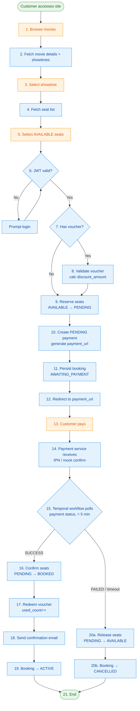
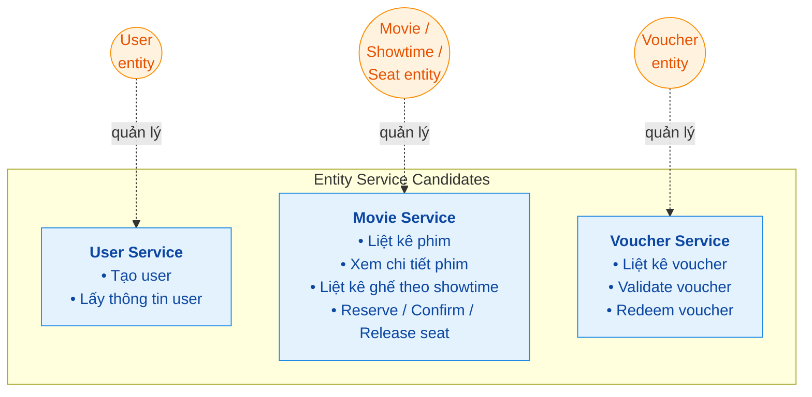
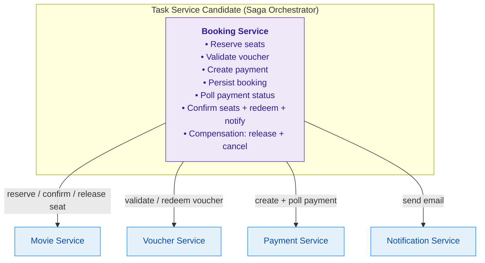
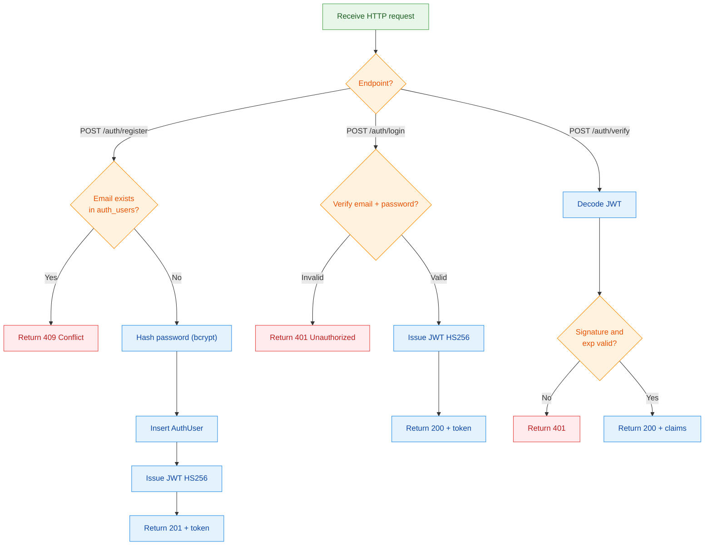
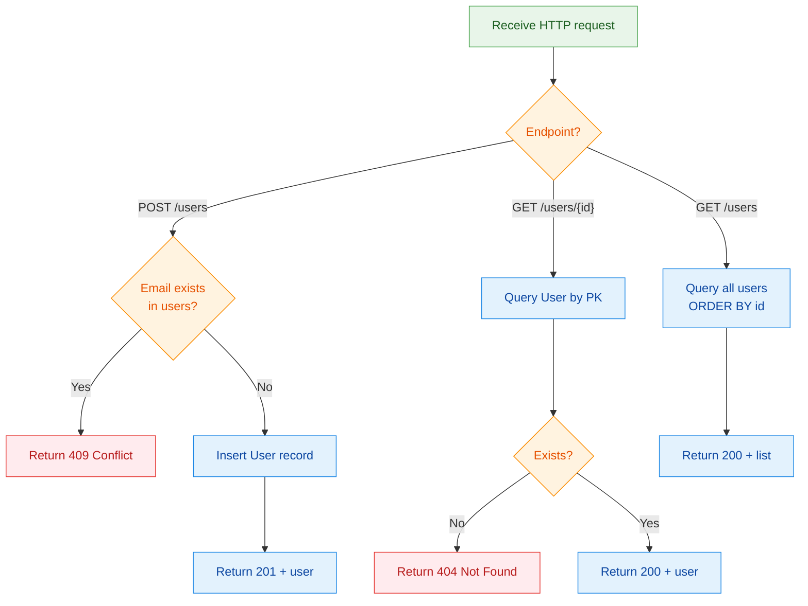
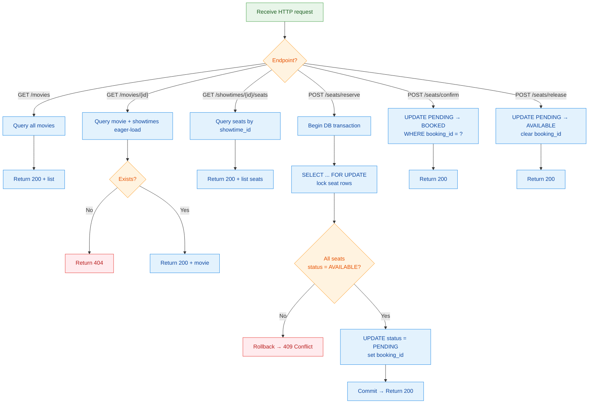
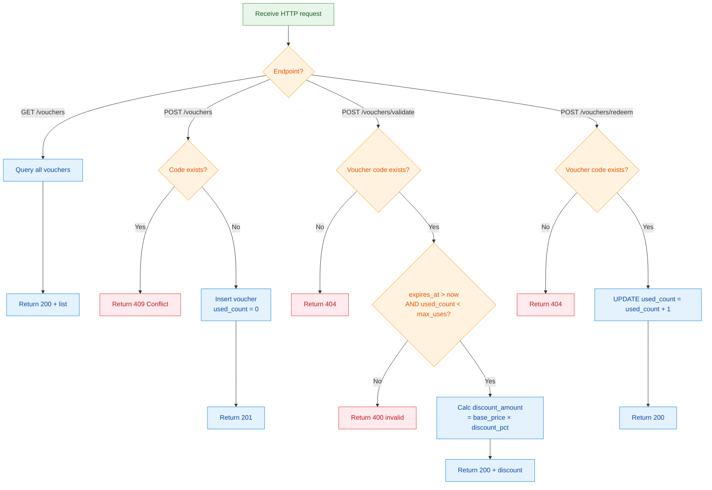
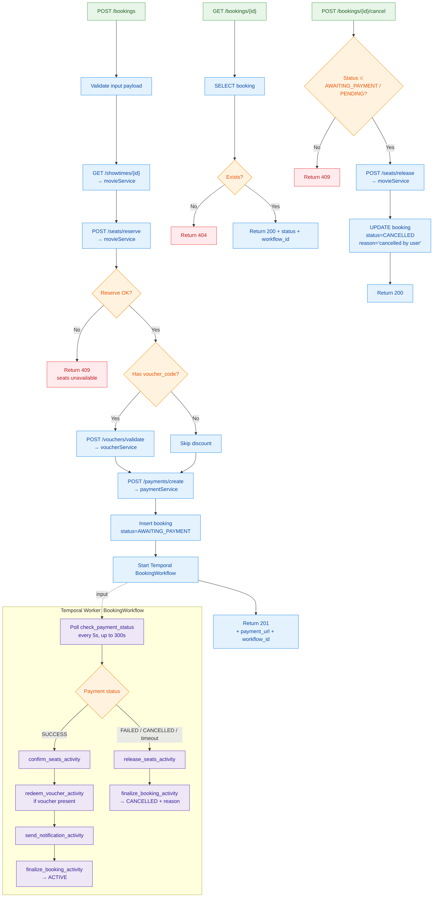
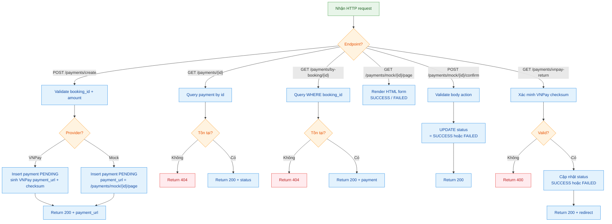
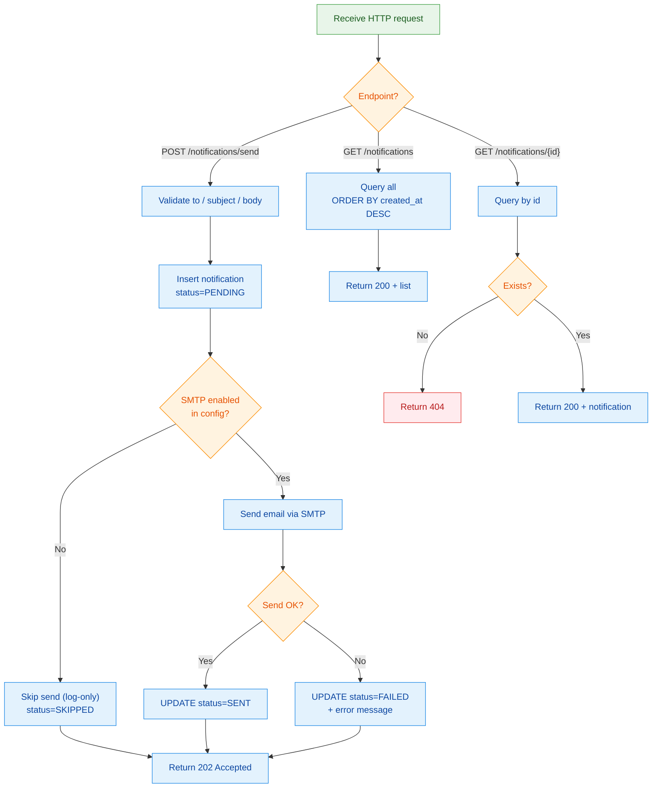

# Analysis and Design — Business Process Automation Solution

> **Goal**: Phân tích một business process cụ thể và thiết kế giải pháp tự động hoá hướng dịch vụ (SOA/Microservices).
> **Scope**: Assignment 4–6 tuần — tập trung vào **một business process**, không phải toàn bộ hệ thống.

**References:**

1. *Service-Oriented Architecture: Analysis and Design for Services and Microservices* — Thomas Erl (2nd Edition)
2. *Microservices Patterns: With Examples in Java* — Chris Richardson
3. *Bài tập — Phát triển phần mềm hướng dịch vụ* — Hung Dang (available in Vietnamese)

---

## 1. 🎯 Problem Statement

- **Domain**: Entertainment — Cinema Booking
- **Problem**: Quy trình đặt vé xem phim truyền thống có các điểm đau:
    - Khách hàng phải đến rạp để mua vé hoặc gọi điện đặt chỗ thủ công.
    - Không có cơ chế giữ ghế tạm thời khi khách đang thanh toán → race condition (nhiều người chọn cùng một ghế).
    - Thanh toán và xác nhận ghế tách rời, dễ xảy ra case đã trừ tiền nhưng chưa giữ được ghế, hoặc ngược lại.
    - Không có cơ chế tự động release ghế khi thanh toán thất bại hoặc bỏ dở giữa chừng.
    - **Mục tiêu**: Tự động hoá toàn bộ quy trình **Đặt vé xem phim online**, từ lúc chọn phim/suất chiếu/ghế đến khi xác nhận vé và gửi thông báo, đảm bảo consistency giữa ghế và thanh toán.
- **Users/Actors**: Khách hàng (customer)
- **Scope**:
    - In scope:
        - Xác thực người dùng: đăng ký, đăng nhập, lấy thông tin tài khoản.
        - Duyệt phim và suất chiếu: xem danh sách phim, chi tiết phim, suất chiếu, ghế còn trống.
        - Giữ ghế tạm thời (PENDING) trong khi thanh toán.
        - Áp mã giảm giá: lấy danh sách voucher, validate, áp dụng vào giá vé.
        - Tích hợp thanh toán: khởi tạo giao dịch (mock hoặc VNPay), xử lý callback/IPN.
        - Xác nhận ghế (BOOKED) + gửi email thông báo khi thanh toán thành công.
        - Compensation (release ghế) khi thanh toán thất bại hoặc timeout.
    - Out of scope:
        - Quản lý rạp/phòng chiếu (cinema management): thêm/xoá rạp, bố trí phòng, sơ đồ ghế phức tạp.
        - Content/media: trailer phim, đánh giá/review, bình luận.
        - Báo cáo doanh thu chuyên sâu, tích hợp kế toán.
        - Chương trình khách hàng thân thiết (loyalty), tích điểm.

**Process Diagram:**

> 
>
> *(Placeholder — nhóm tự tạo flowchart.)*

### 1.2 Existing Automation Systems

| System Name | Type | Current Role | Interaction Method |
|-------------|------|--------------|--------------------|
| Identity Management | Legacy Service | Quản lý định danh khách hàng, cấp và verify JWT. | JWT qua HTTP headers. |
| Movie Catalog DB | Database | Lưu thông tin tĩnh về phim, suất chiếu, sơ đồ ghế. | Read-only access qua service adapter. |
| Voucher Metadata DB | Database | Lưu voucher (code, discount_percentage, expires_at, max_uses). | Read qua service adapter. |
| Payment Gateway (VNPay) | External System | Xử lý luồng tiền thực tế, cung cấp bảo mật giao dịch. | REST API + IPN/return URL. |
| Mail Gateway | External/Legacy | Gửi email xác nhận vé. SMTP hoặc SendGrid/Twilio. | SMTP hoặc REST API. |

### 1.3 Non-Functional Requirements

| Requirement | Description |
|-------------|-------------|
| Performance | Reserve ghế phải trong < 500ms; xử lý callback thanh toán và cấp vé < 2–3 giây. Tránh lock lâu trên seat table. |
| Consistency | Không được có tình trạng trừ tiền mà ghế không được giữ, hoặc giữ ghế mà không thanh toán. Saga orchestration đảm bảo eventual consistency. |
| Security | Bảo mật JWT, validate VNPay IPN bằng checksum, không log PII (số thẻ). |
| Scalability | Horizontal scaling từng service; Temporal worker scale riêng theo tải booking. |
| Availability | Uptime ≥ 99.9% cho luồng đặt vé; compensation tự động khi service phụ thuộc down. |

---

## 2. 🧩 Service-Oriented Analysis

### 2.1 & 2.2 Decompose Business Process & Filter Unsuitable Actions

| Step | Activity | Actor | Description | Suitable? |
|------|----------|-------|-------------|-----------|
| 1 | Duyệt phim | Khách hàng | Khách hàng chọn phim từ danh sách. | ❌ |
| 2 | Lấy chi tiết phim + suất chiếu | Hệ thống | Trả phim + các showtime đang mở bán. | ✅ |
| 3 | Chọn suất chiếu | Khách hàng | Khách hàng chọn một showtime. | ❌ |
| 4 | Lấy danh sách ghế | Hệ thống | Trả toàn bộ ghế của showtime kèm trạng thái. | ✅ |
| 5 | Chọn ghế | Khách hàng | Khách hàng chọn một hoặc nhiều ghế AVAILABLE. | ❌ |
| 6 | Xác thực đăng nhập | Hệ thống | Verify JWT từ gateway; nếu thiếu/hết hạn → yêu cầu đăng nhập. | ✅ |
| 7 | (Tuỳ chọn) Áp voucher | Khách hàng | Khách hàng nhập mã voucher. | ❌ |
| 8 | Validate voucher | Hệ thống | Kiểm tra voucher hợp lệ, tính discount_amount. | ✅ |
| 9 | Reserve ghế (giữ tạm) | Hệ thống | Chuyển ghế AVAILABLE → PENDING trong transaction; fail nếu không còn available. | ✅ |
| 10 | Tạo payment record | Hệ thống | Tạo payment status PENDING, lấy payment_url. | ✅ |
| 11 | Persist booking AWAITING_PAYMENT | Hệ thống | Lưu booking record với status AWAITING_PAYMENT + workflow_id. | ✅ |
| 12 | Điều hướng thanh toán | Hệ thống | Redirect khách sang payment_url (mock page hoặc VNPay sandbox). | ✅ |
| 13 | Thanh toán | Khách hàng | Khách hàng thanh toán trên cổng (hoặc mock confirm). | ❌ |
| 14 | Nhận kết quả thanh toán | Hệ thống | Payment service nhận IPN/return hoặc mock confirm → cập nhật status SUCCESS/FAILED. | ✅ |
| 15 | Workflow polling | Hệ thống | Temporal `BookingWorkflow` poll payment status đến SUCCESS/FAILED/timeout 5m. | ✅ |
| 16 | Confirm ghế (BOOKED) | Hệ thống | Khi payment SUCCESS: chuyển PENDING → BOOKED. | ✅ |
| 17 | Redeem voucher | Hệ thống | Tăng used_count của voucher. | ✅ |
| 18 | Gửi thông báo | Hệ thống | Gửi email xác nhận vé qua NotificationService. | ✅ |
| 19 | Booking ACTIVE | Hệ thống | Chuyển booking → ACTIVE. | ✅ |
| 20 | Compensation | Hệ thống | Khi payment FAILED/timeout: release ghế (PENDING → AVAILABLE), booking → CANCELLED. | ✅ |
| 21 | Kết thúc | Hệ thống | Trả kết quả cho khách hàng. | ❌ |

> Các step ❌: mang tính thủ công / tương tác người dùng, không encapsulate thành service được.

### 2.3 Entity Service Candidates

| Entity | Service Candidate | Agnostic Actions |
|--------|-------------------|------------------|
| User | User Service | Tạo user, lấy thông tin user. |
| Movie / Showtime / Seat | Movie Service | Liệt kê phim, xem chi tiết, liệt kê ghế, reserve/confirm/release ghế. |
| Voucher | Voucher Service | Liệt kê voucher, validate, redeem. |

> 
>
> *(Placeholder — nhóm tự tạo diagram.)*

### 2.4 Task Service Candidate

| Non-agnostic Actions | Task Service Candidate |
|---------------------|------------------------|
| 1. Reserve ghế 2. Validate voucher 3. Tạo payment record 4. Persist booking AWAITING_PAYMENT 5. Poll payment status (Temporal workflow) 6. Confirm ghế + redeem voucher + gửi notification 7. Compensation (release ghế + cancel booking) | **Booking Service (Saga Orchestrator)** |

> 
>
> *(Placeholder — nhóm tự tạo diagram.)*

### 2.5 Identify Resources

- `/auth/`
- `/users/`
- `/movies/`, `/showtimes/`, `/seats/`
- `/vouchers/`
- `/bookings/`
- `/payments/`
- `/notifications/`

| Entity / Process | Resource URI |
|------------------|--------------|
| User | `/users/` |
| Movie | `/movies/` |
| Showtime | `/showtimes/` |
| Seat | `/seats/` |
| Voucher | `/vouchers/` |
| Booking | `/bookings/` |
| Payment | `/payments/` |
| Notification | `/notifications/` |

### 2.6 Associate Capabilities with Resources and Methods

| Service Candidate | Capability | Resource | HTTP Method |
|-------------------|------------|----------|-------------|
| Auth Service | Register | `/auth/register` | POST |
| Auth Service | Login | `/auth/login` | POST |
| Auth Service | Verify JWT | `/auth/verify` | POST |
| User Service | Tạo user | `/users` | POST |
| User Service | Lấy user theo id | `/users/{id}` | GET |
| Movie Service | Liệt kê phim | `/movies` | GET |
| Movie Service | Chi tiết phim | `/movies/{id}` | GET |
| Movie Service | Liệt kê ghế theo showtime | `/showtimes/{id}/seats` | GET |
| Movie Service | Reserve ghế | `/seats/reserve` | POST |
| Movie Service | Confirm ghế | `/seats/confirm` | POST |
| Movie Service | Release ghế | `/seats/release` | POST |
| Voucher Service | Validate voucher | `/vouchers/validate` | POST |
| Voucher Service | Redeem voucher | `/vouchers/redeem` | POST |
| Booking Service | Tạo booking | `/bookings` | POST |
| Booking Service | Xem booking | `/bookings/{id}` | GET |
| Booking Service | Cancel booking | `/bookings/{id}/cancel` | POST |
| Payment Service | Tạo payment | `/payments/create` | POST |
| Payment Service | Xem payment | `/payments/{id}` | GET |
| Payment Service | VNPay return/IPN | `/payments/vnpay-return` | GET |
| Notification Service | Gửi notification | `/notifications/send` | POST |

### 2.7 Utility Service & Microservice Candidates

| Candidate | Type | Justification |
|-----------|------|---------------|
| Authentication Service | Utility | Logic verify JWT là cross-cutting, được gateway và indirectly tất cả service khác dựa vào; không chứa logic nghiệp vụ booking. |
| Notification Service | Utility | Gửi email là tiện ích kỹ thuật, có thể tái sử dụng cho nhiều use case khác (promo, reminder). |
| Payment Service | Microservice | Tích hợp VNPay (external), bảo mật khắt khe, cần autonomy cao và scale độc lập khi đột biến giao dịch. |
| Booking Service | Microservice (Orchestrator) | Chứa logic nghiệp vụ chính của luồng đặt vé, điều phối saga qua Temporal workflow; autonomy cao, được thiết kế có compensation rõ ràng. |

### 2.8 Service Composition Candidates

Sequence diagram mô tả cách các Service Candidate cộng tác để hoàn thành luồng đặt vé.

> 
>
> *(Placeholder — nhóm tự tạo diagram.)*

---

## Part 3 — Service-Oriented Design

### 3.1 Uniform Contract Design

Service contract cho từng service. Full OpenAPI specs:

- [`docs/api-specs/AuthenticationService.yaml`](api-specs/AuthenticationService.yaml)
- [`docs/api-specs/UserService.yaml`](api-specs/UserService.yaml)
- [`docs/api-specs/MovieService.yaml`](api-specs/MovieService.yaml)
- [`docs/api-specs/VoucherService.yaml`](api-specs/VoucherService.yaml)
- [`docs/api-specs/BookingService.yaml`](api-specs/BookingService.yaml)
- [`docs/api-specs/PaymentService.yaml`](api-specs/PaymentService.yaml)
- [`docs/api-specs/NotificationService.yaml`](api-specs/NotificationService.yaml)

#### **Authentication Service**

| Endpoint | Method | Media Type | Response Codes |
|:---|:---|:---|:---|
| `/auth/register` | POST | `application/json` | 201 Created, 400 Bad Request, 409 Conflict, 500 Internal Server Error |
| `/auth/login` | POST | `application/json` | 200 OK, 401 Unauthorized, 500 Internal Server Error |
| `/auth/verify` | POST | `application/json` | 200 OK, 401 Unauthorized |
| `/health` | GET | `text/plain` | 200 OK |

#### **User Service**

| Endpoint | Method | Media Type | Response Codes |
|:---|:---|:---|:---|
| `/users` | POST | `application/json` | 201 Created, 400 Bad Request, 409 Conflict |
| `/users` | GET | `application/json` | 200 OK |
| `/users/{id}` | GET | `application/json` | 200 OK, 404 Not Found |
| `/health` | GET | `text/plain` | 200 OK |

#### **Movie Service**

| Endpoint | Method | Media Type | Response Codes |
|:---|:---|:---|:---|
| `/movies` | GET | `application/json` | 200 OK |
| `/movies/{id}` | GET | `application/json` | 200 OK, 404 Not Found |
| `/showtimes/{id}` | GET | `application/json` | 200 OK, 404 Not Found |
| `/showtimes/{id}/seats` | GET | `application/json` | 200 OK, 404 Not Found |
| `/seats/reserve` | POST | `application/json` | 200 OK, 400 Bad Request, 409 Conflict |
| `/seats/confirm` | POST | `application/json` | 200 OK, 409 Conflict |
| `/seats/release` | POST | `application/json` | 200 OK, 409 Conflict |
| `/health` | GET | `text/plain` | 200 OK |

#### **Voucher Service**

| Endpoint | Method | Media Type | Response Codes |
|:---|:---|:---|:---|
| `/vouchers` | GET | `application/json` | 200 OK |
| `/vouchers` | POST | `application/json` | 201 Created, 400 Bad Request, 409 Conflict |
| `/vouchers/validate` | POST | `application/json` | 200 OK, 400 Bad Request, 404 Not Found |
| `/vouchers/redeem` | POST | `application/json` | 200 OK, 404 Not Found |
| `/health` | GET | `text/plain` | 200 OK |

#### **Booking Service**

| Endpoint | Method | Media Type | Response Codes |
|:---|:---|:---|:---|
| `/bookings` | POST | `application/json` | 200 OK, 400 Bad Request, 409 Conflict, 503 Service Unavailable, 500 Internal Server Error |
| `/bookings/{id}` | GET | `application/json` | 200 OK, 404 Not Found |
| `/bookings/user/{user_id}` | GET | `application/json` | 200 OK |
| `/bookings/{id}/cancel` | POST | `application/json` | 200 OK, 404 Not Found, 409 Conflict |
| `/health` | GET | `text/plain` | 200 OK |

#### **Payment Service**

| Endpoint | Method | Media Type | Response Codes |
|:---|:---|:---|:---|
| `/payments/create` | POST | `application/json` | 200 OK, 400 Bad Request, 500 Internal Server Error, 503 Service Unavailable |
| `/payments/{id}` | GET | `application/json` | 200 OK, 404 Not Found |
| `/payments/by-booking/{booking_id}` | GET | `application/json` | 200 OK, 404 Not Found |
| `/payments/mock/{id}/confirm` | POST | `application/json` | 200 OK, 404 Not Found |
| `/payments/mock/{id}/page` | GET | `text/html` | 200 OK |
| `/payments/vnpay-return` | GET | `application/json` | 200 OK |
| `/health` | GET | `text/plain` | 200 OK |

#### **Notification Service**

| Endpoint | Method | Media Type | Response Codes |
|:---|:---|:---|:---|
| `/notifications/send` | POST | `application/json` | 202 Accepted, 400 Bad Request, 503 Service Unavailable |
| `/notifications` | GET | `application/json` | 200 OK |
| `/notifications/{id}` | GET | `application/json` | 200 OK, 404 Not Found |
| `/health` | GET | `text/plain` | 200 OK |

### 3.2 Service Logic Design

Flow nội bộ cho từng service (placeholder — nhóm tự tạo diagram đặt vào `docs/asset/`).

**Authentication Service:**

> 

**User Service:**

> 

**Movie Service:**

> 

**Voucher Service:**

> 

**Booking Service:**

> 

**Payment Service:**

> 

**Notification Service:**

> 
